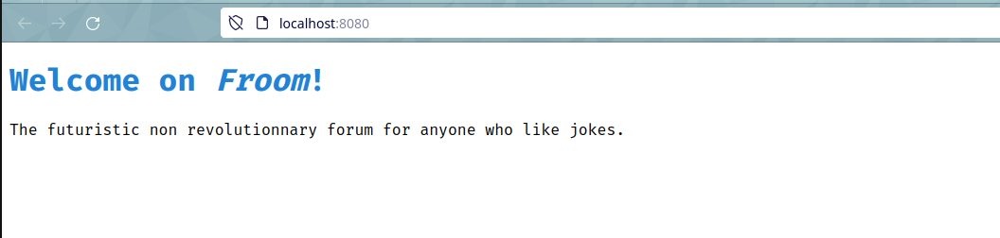
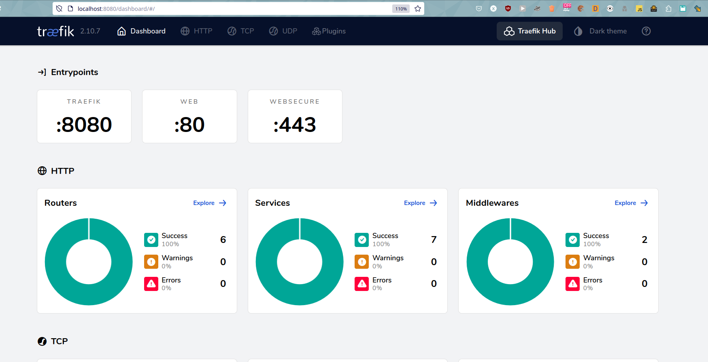
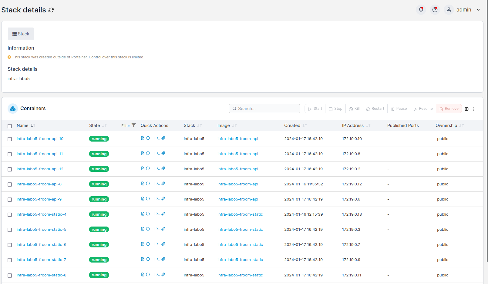
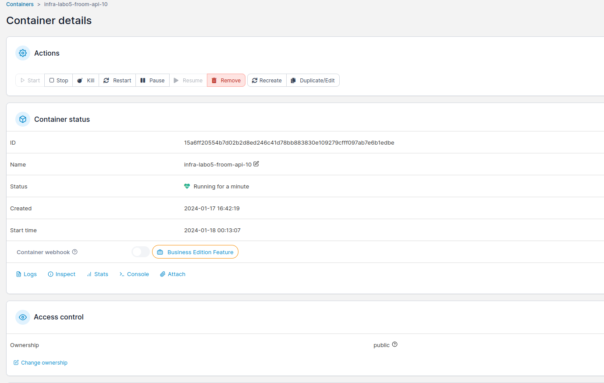
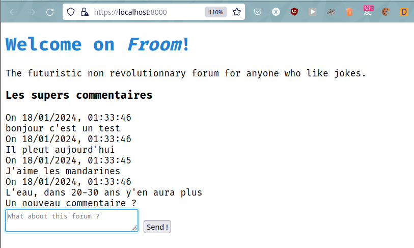
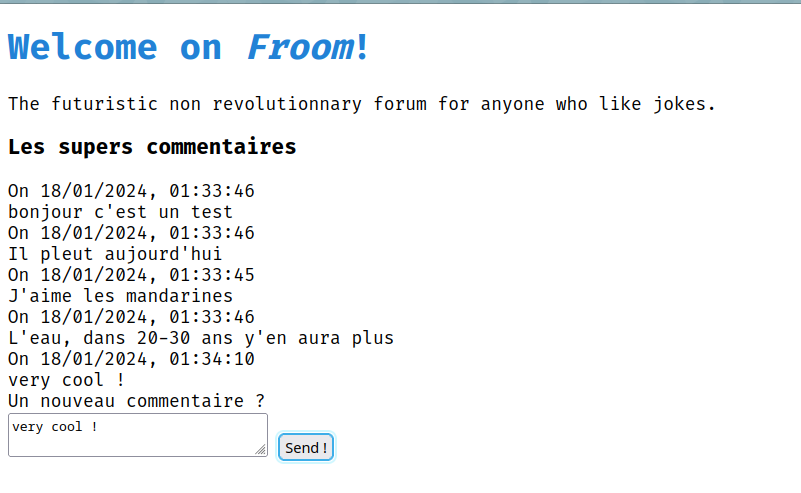

# Froom - DAI Lab - HTTP infrastructure

Froom is just another forum system with strange features. Here is how we developed and deployed the Froom infrastructure.

## Static website
We placed all files for the static website under [froom-static](froom-static/).

Here are the files we created:
- `index.html`: We have created our own simple `index.html` with a little landing page for Froom.
- `Dockerfile`
  ```dockerfile
	# based on Nginx image from Docker Hub
	FROM nginx 
	# Copy the nginx configuration at one of the default configuration place
	COPY nginx.conf /etc/nginx/nginx.conf 
	# copy our website in the folder dedicated to this website (defined in nginx.conf)
	COPY index.html /var/www/froom/index.html 
  ```
- `nginx.conf`
	```nginx 
	# Necessary to avoid error 'nginx: [emerg] no "events" section in configuration'
	events{}	

	http {
		server {
			# Listening port, the standard HTTP port
			listen       80;
			# The domain name of this website, useful if we want several website on the server IP
			server_name  froom.local;
			# The root folder of our website (we copied our index.html there)
			root         /var/www/froom;
		}
	}
	```

To build the image (tagged as `froom` to easily identify it)
```
sudo docker build -t froom .
```
And to start a container from this image
```
sudo docker run -p 8080:80 froom
```

You can now access on your host machine the website under the port `8080`. First configure `127.0.0.1	 froom.local` in your hosts file then you can access the static website on `froom.local:8080`.



## Step 2 - Docker compose 

```yml
services:
# a new service for the static website
  froom-static:
    # to refer the froom-static folder with the Dockerfile inside
    build: 
      context: froom-static
    # Mapped the host's port (80) with the docker container port (80) used by nginx
    ports:
    - "80:80"
    
```

Test for the docker build

```
sudo docker compose build
```
```
[+] Building 0.9s (8/8) FINISHED                                                                                                                                                  docker:default
 => [froom-static internal] load .dockerignore                                                                                                                                              0.0s
 => => transferring context: 2B                                                                                                                                                             0.0s
 => [froom-static internal] load build definition from Dockerfile                                                                                                                           0.0s
 => => transferring dockerfile: 117B                                                                                                                                                        0.0s
 => [froom-static internal] load metadata for docker.io/library/nginx:latest                                                                                                                0.7s
 => [froom-static 1/3] FROM docker.io/library/nginx@sha256:2bdc49f2f8ae8d8dc50ed00f2ee56d00385c6f8bc8a8b320d0a294d9e3b49026                                                                 0.1s
 => => resolve docker.io/library/nginx@sha256:2bdc49f2f8ae8d8dc50ed00f2ee56d00385c6f8bc8a8b320d0a294d9e3b49026                                                                              0.1s
 => [froom-static internal] load build context                                                                                                                                              0.0s
 => => transferring context: 61B                                                                                                                                                            0.0s
 => CACHED [froom-static 2/3] COPY nginx.conf /etc/nginx/nginx.conf                                                                                                                         0.0s
 => CACHED [froom-static 3/3] COPY index.html /var/www/froom                                                                                                                                0.0s
 => [froom-static] exporting to image                                                                                                                                                       0.0s
 => => exporting layers                                                                                                                                                                     0.0s
 => => writing image sha256:40858cee24286c1609221c9426dc64fc03ebf11795f20f52708008818c98f125                                                                                                0.0s
 => => naming to docker.io/library/dai-lab-http-infrastructure-froom-static 
```


## Step 3 - HTTP API server
To package our Javalin server
```sh
mvn package
```

To run it
```sh
java -jar target/server-1.0-SNAPSHOT.jar
```

We have a GET route on / (the inital arriving page) to send a Hello message when arriving on this home page.
```java
app.get("/", ctx -> ctx.result(HELLO_MESSAGE));
```

and then the routes for all the CRUD operations related to comments: Create (One and All), Read, Update, Delete.

```java
app.get("/comments/{id}", commentsController::getOne);
app.get("/comments", commentsController::getAll);
app.post("/comments", commentsController::create);
app.delete("/comments/{id}", commentsController::delete);
app.put("/comments/{id}", commentsController::update);
```

We wrote integration tests to make sure our implementation really works (see the `CommentsTests.java`) and we tried a few routes with Bruno for easier visualisation.

In this example, we made a POST request to create a new comment :


and then we see the expected answer from the server :


## Step 4 - Reverse proxy

We had to prefix our API routes with `/api`.

We added a label to indicate to Traefik that the rule to route the traffic to a `froom-static` container is that the host has to be `localhost`. We had to put the service after the `froom-api` because the match criterion has less conditions.
```yml
  froom-static:
    build: 
      context: froom-static
    labels:
      - "traefik.http.routers.froom-static.rule=Host(`localhost`)" # added this
```

Same for `froom-api` but with the additionnal condition that the HTTP request path has to be prefixed with `/api`
```yml
  froom-api:
    build:
      context: froom
    labels:
      - "traefik.http.routers.froom-api.rule=Host(`localhost`) && PathPrefix(`/api`)" # added this
```

To configure traefik we mostly copy pasted what was given in the official documentation
```yml
  traefik:
    image: traefik:v2.10
    command: --api.insecure=true --providers.docker
    ports:
      - "8000:80" # this has changed later in step 7
      - "8080:8080"
    volumes:
      - /var/run/docker.sock:/var/run/docker.sock
```

In conclucions, when running our infrastructure with
```
sudo docker compose up
```
we now can see that traefik container running
```
[+] Running 3/0
 ✔ Container infra-labo5-traefik-1       Created                                                                                                                                   0.0s 
 ✔ Container infra-labo5-froom-api-1     Created                                                                                                                                   0.0s 
 ✔ Container infra-labo5-froom-static-1  Created                                                                                                                                   0.0s 
Attaching to infra-labo5-froom-api-1, infra-labo5-froom-static-1, infra-labo5-traefik-1
```

When we test to visit the 2 websites on `localhost:8000` and then `localhost:8000/api/comments`, we see that routing the expected pages and the live logs show Traefik is doing the routing to both containers.

```
infra-labo5-froom-static-1  | 172.19.0.3 - - [11/Jan/2024:08:37:12 +0000] "GET / HTTP/1.1" 304 0 "-" "Mozilla/5.0 (X11; Linux x86_64; rv:121.0) Gecko/20100101 Firefox/121.0"
infra-labo5-froom-static-1  | 172.19.0.3 - - [11/Jan/2024:08:37:42 +0000] "GET / HTTP/1.1" 304 0 "-" "Mozilla/5.0 (X11; Linux x86_64; rv:121.0) Gecko/20100101 Firefox/121.0"

infra-labo5-froom-api-1     | New request GET on /api/comments
```

To access traefik dashboard to debug or see details about routing configuration, you just need to visit `localhost:8080` in your browser.



## Step 5 - Scalability and load-balancing
To add replicated instances, we just added `deploy.replicas` to 5, for the 2 services
```yaml
deploy:
    replicas: 5
```

And to change this value dynamically when the infrastructure is already up, here is an example to scale from 5 to 10 froom-static instances:
```sh
sudo docker compose up --scale froom-static=10 -d
```

We see there is now 10 instances running

```
$ sudo docker compose ps
NAME                          IMAGE                      COMMAND                                           SERVICE       ...
...
infra-labo5-froom-static-1    infra-labo5-froom-static   "/docker-entrypoint.sh nginx -g 'daemon off;'"    froom-static  ...
infra-labo5-froom-static-10   infra-labo5-froom-static   "/docker-entrypoint.sh nginx -g 'daemon off;'"    froom-static  ...
infra-labo5-froom-static-11   infra-labo5-froom-static   "/docker-entrypoint.sh nginx -g 'daemon off;'"    froom-static  ...
infra-labo5-froom-static-2    infra-labo5-froom-static   "/docker-entrypoint.sh nginx -g 'daemon off;'"    froom-static  ...
infra-labo5-froom-static-4    infra-labo5-froom-static   "/docker-entrypoint.sh nginx -g 'daemon off;'"    froom-static  ...
infra-labo5-froom-static-5    infra-labo5-froom-static   "/docker-entrypoint.sh nginx -g 'daemon off;'"    froom-static  ...
infra-labo5-froom-static-6    infra-labo5-froom-static   "/docker-entrypoint.sh nginx -g 'daemon off;'"    froom-static  ...
infra-labo5-froom-static-7    infra-labo5-froom-static   "/docker-entrypoint.sh nginx -g 'daemon off;'"    froom-static  ...
infra-labo5-froom-static-8    infra-labo5-froom-static   "/docker-entrypoint.sh nginx -g 'daemon off;'"    froom-static  ...
infra-labo5-froom-static-9    infra-labo5-froom-static   "/docker-entrypoint.sh nginx -g 'daemon off;'"    froom-static  ...
...
```

If we only want 3 instances, now we can use the same commands to down scale our infra:
```sh
sudo docker compose up --scale froom-static=3 -d
```

Then we only have 3 static instances:
```
$ sudo docker compose ps
NAME                         IMAGE                      COMMAND                                         SERVICE     
infra-labo5-froom-api-2      infra-labo5-froom-api      "java -jar server.jar"                          froom-api   
infra-labo5-froom-api-3      infra-labo5-froom-api      "java -jar server.jar"                          froom-api   
infra-labo5-froom-api-4      infra-labo5-froom-api      "java -jar server.jar"                          froom-api   
infra-labo5-froom-api-5      infra-labo5-froom-api      "java -jar server.jar"                          froom-api   
infra-labo5-froom-api-6      infra-labo5-froom-api      "java -jar server.jar"                          froom-api   
infra-labo5-froom-static-2   infra-labo5-froom-static   "/docker-entrypoint.sh nginx -g 'daemon off;'"  froom-static
infra-labo5-froom-static-4   infra-labo5-froom-static   "/docker-entrypoint.sh nginx -g 'daemon off;'"  froom-static
infra-labo5-froom-static-6   infra-labo5-froom-static   "/docker-entrypoint.sh nginx -g 'daemon off;'"  froom-static
...
```

## Step 6 - sticky sessions

To be able to handle a load balacing with sticky session server, we modified the `docker-compose.yml` as so :

First to activate sticky sessions we included into the docker compose file :

```dockerfile
- "traefik.http.services.froom-api.loadbalancer.sticky=true"
```

then we give this cookie a name with the following command :

```dockerfile
- "traefik.http.services.froom-api.loadbalancer.sticky.cookie.name=StickyCookie"
```

and we make it secure by adding this command :

```dockerfile
- "traefik.http.services.froom-api.loadbalancer.sticky.cookie.secure=true"
```

### Demonstration

We did 9 page refreshes on the API to prove that sticky session is working (in the example we see they are all routed to the first container).

Then we did 5 page refreshes on the static website to show that Round-Robin is still active and is working. (In the example we see each replica one after the )

```
dai-lab-http-infrastructure-froom-api-1     | New request GET on /api/comments
dai-lab-http-infrastructure-froom-api-1     | New request GET on /api/comments
dai-lab-http-infrastructure-froom-api-1     | New request GET on /api/comments
dai-lab-http-infrastructure-froom-api-1     | New request GET on /api/comments
dai-lab-http-infrastructure-froom-api-1     | New request GET on /api/comments
dai-lab-http-infrastructure-froom-api-1     | New request GET on /api/comments
dai-lab-http-infrastructure-froom-api-1     | New request GET on /api/comments
dai-lab-http-infrastructure-froom-api-1     | New request GET on /api/comments
dai-lab-http-infrastructure-froom-api-1     | New request GET on /api/comments
dai-lab-http-infrastructure-froom-static-3  | 172.22.0.2 - - [12/Jan/2024:16:43:14 +0000] "GET / HTTP/1.1" 304 0 "-" "Mozilla/5.0 (X11; Ubuntu; Linux x86_64; rv:121.0) Gecko/20100101 Firefox/121.0"
dai-lab-http-infrastructure-froom-static-4  | 172.22.0.2 - - [12/Jan/2024:16:43:15 +0000] "GET / HTTP/1.1" 304 0 "-" "Mozilla/5.0 (X11; Ubuntu; Linux x86_64; rv:121.0) Gecko/20100101 Firefox/121.0"
dai-lab-http-infrastructure-froom-static-1  | 172.22.0.2 - - [12/Jan/2024:16:43:15 +0000] "GET / HTTP/1.1" 304 0 "-" "Mozilla/5.0 (X11; Ubuntu; Linux x86_64; rv:121.0) Gecko/20100101 Firefox/121.0"
dai-lab-http-infrastructure-froom-static-5  | 172.22.0.2 - - [12/Jan/2024:16:43:15 +0000] "GET / HTTP/1.1" 304 0 "-" "Mozilla/5.0 (X11; Ubuntu; Linux x86_64; rv:121.0) Gecko/20100101 Firefox/121.0"
dai-lab-http-infrastructure-froom-static-2  | 172.22.0.2 - - [12/Jan/2024:16:43:15 +0000] "GET / HTTP/1.1" 304 0 "-" "Mozilla/5.0 (X11; Ubuntu; Linux x86_64; rv:121.0) Gecko/20100101 Firefox/121.0"
```

## Step 7 - HTTPs
We created a folder `ssl` and commited our certs for the demo.

We completed our `docker-compose.yml` on the 2 services to enable TLS and use a Traefik entrypoint supporting HTTPS
```yml
      - "traefik.http.routers.froom-api.tls=true"
      - "traefik.http.routers.froom-api.entrypoints=websecure"
```

On the traefik service we had to add 2 volumes to mount the ssl certificates in the expected folder and the traefik configuration.
```yml
    volumes:
      - /var/run/docker.sock:/var/run/docker.sock
      - ./ssl:/etc/traefik/certificates
      - ./traefik.yaml:/etc/traefik/traefik.yaml
```

We had to configure Traefik in `traefik.yml` to indicate we are using Docker, to create the 2 entry points on ports 80 and 443. We added the path to certificates as mounted with volumes.
```yml
providers:
  docker: {}
entryPoints:
  web:
    address: ":80"

  websecure:
    address: ":443"

tls:
  certificates:
    - certFile: /etc/traefik/certificates/cert.pem
      keyFile: /etc/traefik/certificates/key.pem

api:
  dashboard: true
  insecure: true
```

We had to change the port mapping for traefik
```yml
  traefik:
    image: traefik:v2.10
    command: --api.insecure=true --providers.docker
    ports:
      - "8000:443"  # changed this from 8000:80 to 8000:443
      - "8080:8080"
```

## Step 8 - Docker GUI
We found Portainer, a Docker GUI that can help manages Docker instances.

We configured it like this:
```yml
  portainer:
    image: portainer/portainer
    ports:
      - 9000:9000 
    volumes:
      - /var/run/docker.sock:/var/run/docker.sock
```

We tried to add another label `io.portainer.accesscontrol.public` to our 2 services to try to fix the issue of `This stack was created outside of Portainer. Control over this stack is limited.` but actually this doesn't limit us to duplicate instances, remove them, rename and pause, so maybe this is the state that we were expected to reach.





## Step 9

We just wrote a bunch of vanilla Javascript and AlpineJS and are now using our API. Here is a demo of our list of comments periodically loading each 5 seconds.



We can even create a new comment and it appears on next reload.


